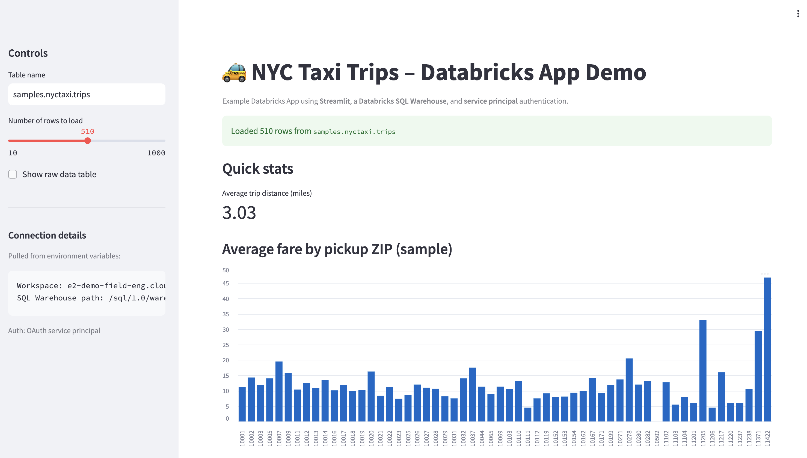
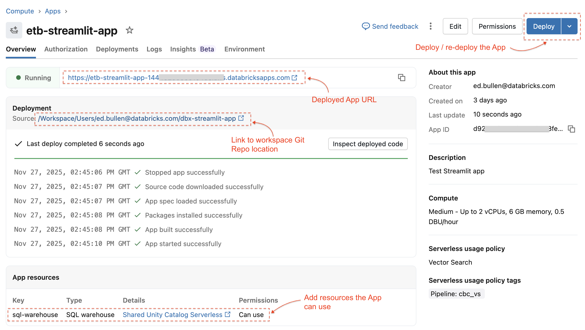

# Simple Databricks App - NYC Taxis

 


## Deploy a Databricks App 

Lightweight demonstration to show how the following components can be integrated and run on Databricks:

+ Streamlit for rapid web-app development and serving from Databricks 
+ Databricks SQL Warehouse for analytic data queries
+ Lakebase Postgres Database for transactional data - EG config and logging data in this example
+ App Authentication to Databricks Services (no key or token files to maintain)

### Repo Files

```
 | app.py
 | warehouse_queries.py
 | lakebase_psql.py
 | app.yaml - Databricks Apps env setting, not used during local dev / test
 | .env - create this for local IDE dev / test only
 | data/
      | *.json
```

### Tests

```
PYTHONPATH=. pytest -v
```

## Setup:  
The following environment vars need to be set in `app.yaml` for when the app is deployed to Databricks workspace compute:  
+ `DATABRICKS_SERVER_HOSTNAME`  - the Databricks workspace URL, example: `dbc-xxxx.cloud.databricks.com`
+ `DATABRICKS_HTTP_PATH` - The SQL warehouse URL, example: `/sql/1.0/warehouses/xxxx` 

Also, the command to run the app must be set in the `app.yaml` file:

+ `command: ["streamlit", "run", "app.py"]`   

### Configuring the SQL Warehouse and Lakebase Postgres DB


Create or identify a Lakbase Database instance (transaction database) to use for config data and logs.

- Grant access to the App to use the *SQL Warehouse*.  
  - Edit, click "Next" to get to App resources, add SQL Warehouse 
  - select the SQL warehouse that is already  configured in the YAML file 
- Grant access to the App to use the *Lakebase database* (see [instructions](https://docs.databricks.com/aws/en/dev-tools/databricks-apps/lakebase#add-a-database-resource)).  
    - Choose the default `databricks_postgres` database and use the  *resource key* `database`. 
    - From the linked doc: *Databricks creates a PostgreSQL role in the selected database instance. The role name matches the service principal's client ID*
    - From the linked doc: *Databricks grants the service principal CONNECT and CREATE privileges on the selected database.*


## Running Locally for Development and Testing

1. Setup the local environment variables in the `.env` file, to be picked up by `load_dotenv()`:

```
# Workspace Web address and path to SQL Warehouse
DATABRICKS_SERVER_HOSTNAME=<myworkspace>.cloud.databricks.com  # No `https` prefix or trailing `/`  
DATABRICKS_HTTP_PATH=/sql/1.0/warehouses/################

# Lakebase postgres instance 
PGHOST=instance-########-####-####-####-############.database.cloud.databricks.com
PGDATABASE=databricks_postgres
PGUSER=<youemail@you.com>  # this is the email for your local operations that you OAUTH to the DBX env with (step 2)

# Stub the Databricks SSO user-id details
LOCAL_DEV_EMAIL=dummy@email.com
```

- Make sure the `.env` file is not committed in the source code repo


2. Authenticate to the Databricks Workspace where the SQL Warehouse and Lakebases Database is running.  

- Use [U2M Auth with the Databricks CLI](https://docs.databricks.com/aws/en/dev-tools/cli/authentication#oauth-user-to-machine-u2m-authentication).  

```
# Authenticate to a profile configured in ~/.databrickscfg
databricks auth profiles # list profiles

databricks auth login -p my_profile_name
```

3. Run the app:  
`streamlit run app.py`

3. Go to the browser:   
`http://localhost:8501/`  

## Deploy to Databricks Compute:  

1. Clone your repo to the Workspace:  
*Databricks -> Workspace -> "Create" -> Git Folder* 

2. Create an App:  
*Databricks -> Compute -> Apps tab -> "Create app" -> "Create a custom app"*

3. From the main Overview page for the App (Compute -> Apps -> App Name):  
Select "Deploy"   
Select the path to the cloned repo, and deploy it  

## Push development changes to Databricks App

Changes being developed on a laptop IDE can be syncronised by commiting to a local git repo, pushing to the central shared repo, then pulling into the Databricks workspace repo from the central shared repo.

1. Commit changes  
2. `git push origin main` / `git push origin <branch>`  
3. Go to the Workspace git repo and pull new changes on the branch being used.
4. Go to the app and re-deploy it


 


